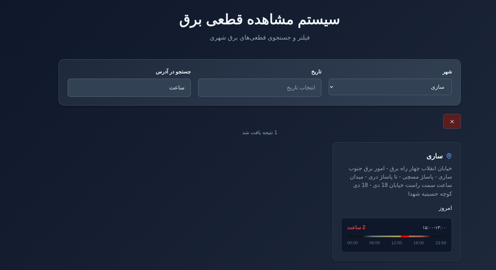

# North Outage

North Outage is a tool for monitoring and viewing electricity outage information for the north of Iran. It scrapes data from the electricity distribution company and presents it in a user-friendly web interface.



## Features

-   **Data Collection:** Automatically scrapes outage data from the official website.
-   **Web Interface:** A clean and modern web UI to view and filter outage information.
-   **Timeline View:** Visualizes outage times on a daily timeline.
-   **Filtering:** Allows filtering outages by city and address.
-   **Go Backend:** A robust backend written in Go.
-   **React Frontend:** A responsive frontend built with React and TypeScript.

## Getting Started

### Prerequisites

-   Go (version 1.25 or newer)
-   Make

### Installation & Running

1.  **Clone the repository:**
    ```bash
    git clone https://github.com/fmotalleb/north_outage.git
    cd north_outage
    ```

2.  **Configuration:**
    Copy the example configuration file:
    ```bash
    cp example/config.toml config.toml
    ```
    You can edit `config.toml` to change settings like the listening port and database path.

3.  **Build the application:**
    ```bash
    make build
    ```

4.  **Run the application:**
    ```bash
    make run
    ```
    The web server will start on the port specified in your `config.toml` (default is `:9090`).

## Configuration

The application is configured using a `config.toml` file. Here are some of the key options:

-   `http_listen`: The address and port for the web server (e.g., `:9090`).
-   `database`: The database connection string (e.g., `sqlite://outage.db`).
-   `collect_cycle`: How often to scrape for new data, using cron format (e.g., `@hourly`).
-   `max_age`: The maximum age of outage data to keep.

The collector pipeline for scraping is also defined in this file.

## Tech Stack

-   **Backend:** Go
-   **Frontend:** React, TypeScript, Vite, Tailwind CSS
-   **Scraping:** Playwright
-   **Database:** SQLite (by default)

## Contributing

Contributions are welcome! Please feel free to submit a pull request.
